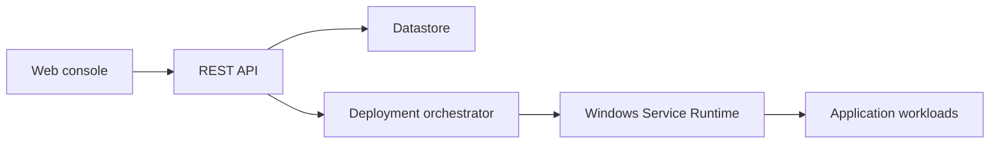

<div align="center">


# NovaDock

### Deploy and operate Windows applications with confidence.

**NovaDock is the control plane for registering workloads, orchestrating deployments, and running verified Windows services—so your team ships faster with full operational visibility.**

[](https://nextjs.org/)
[](https://www.typescriptlang.org/)
[](LICENSE)

[Get started](#getting-started) · [Documentation](docs/README.md) · [API](docs/api.md) · [Roadmap](#roadmap)

<br />

<a href="docs/deployment.md"></a>
&nbsp;
<a href="docs/README.md"></a>

</div>

<br />


---

## Why NovaDock

Windows remains the backbone of enterprise applications—line-of-business APIs, internal portals, integration services, and long-running workers. Yet most teams still rely on **manual scripts, one-off service installs, and fragile restart procedures** for every new workload.

That creates predictable pain:

- **Slow time-to-production** — each application needs bespoke service wiring.
- **Unclear deploy outcomes** — failures surface without structured logs or retry boundaries.
- **Operational blind spots** — no single view of what is running, failing, or waiting.
- **Inconsistent standards** — every team invents its own deployment playbook.

NovaDock addresses this by providing a **unified deployment and operations platform** for Windows application workloads—with intelligent orchestration, health verification, and auditable history built in.

---

## Product overview

NovaDock helps your team **accomplish** the following without leaving a single console:

| Goal | How NovaDock helps |
|------|---------------------|
| **Register a new service** | Guided deploy wizard with runtime templates |
| **Ship to Windows** | Automated service registration and startup |
| **Know it is healthy** | HTTP health verification with bounded retries |
| **Operate with confidence** | Dashboard KPIs, deploy logs, and history |
| **Automate at scale** | REST API for CI/CD and internal tooling |

You define the application once. NovaDock orchestrates the rest.

---

## Visual showcase

| Dashboard | Deploy wizard |
|:---:|:---:|
| Fleet KPIs, status overview, application registry | Template selection and one-click deployment |
|  | Configure name, runtime, port, and health checks at `/apps/new` |

| Application detail | Settings |
|:---:|:---:|
| Service configuration, **deploy logs**, deploy history | Applications root, runtime path, simulation mode |
| Per-application operations: redeploy, stop, remove | Platform defaults for your Windows hosts |

**Monitoring** is delivered through dashboard KPIs (running, deploying, failed) and per-application deploy history—not a separate monitoring product.

---

## Core capabilities

### Deployment automation

Template-driven registration for Node.js, Python, .NET, and custom executables. One action triggers the full orchestration pipeline.

### Health monitoring

Every deployment verifies an HTTP health endpoint before marking success. Failures trigger bounded retries with clear halt reasons.

### Deployment history

Each deploy run records phase, attempts, logs, and timestamps—ready for post-incident review and compliance-friendly audit trails.

### Configuration management

Central settings for applications root, Windows Service Runtime path, and development simulation—plus per-application runtime definitions.

### Runtime management

Start, stop, redeploy, and remove services from the console or API. Services follow consistent `NovaDock-{slug}` naming.

### Operational insights

Real-time fleet statistics and application-level status badges keep operators informed without shell access.

---

## Enterprise readiness

| Pillar | Today | Direction |
|--------|-------|-----------|
| **Security** | Internal-network deployment; audit via deploy history | Authentication, RBAC, API keys ([Security](docs/security.md)) |
| **Auditability** | Deploy runs, logs, halt reasons in SQLite | Export APIs, centralized audit stream |
| **Scalability** | Single-node control plane + SQLite | PostgreSQL, multi-host fleet |
| **Extensibility** | REST API, custom templates, agent scripts | CLI, webhooks, manifest files |
| **Cross-platform** | Control plane on any OS; Windows production runtime | Additional runtime targets on roadmap |
| **API-first** | Full CRUD + deploy/stop via REST | OpenAPI, authenticated automation |

NovaDock is built for teams that expect platforms to **integrate with existing pipelines** rather than replace them.

---

## Architecture



| Component | Responsibility |
|-----------|----------------|
| **Web console** | Dashboard, deploy wizard, application detail, settings |
| **REST API** | Automation and CI/CD integration |
| **Deployment orchestrator** | Prepare → register → start → verify with retries |
| **Windows Service Runtime** | Service lifecycle on Windows hosts |
| **Datastore** | Applications, deploy runs, platform settings |

Deep dive: [Architecture documentation](docs/architecture.md)

---

## Getting started

### Prerequisites

- Node.js 20+
- pnpm 9+

### Install and run

```bash
git clone https://github.com/shivamongit/new.git
cd new/novadock
pnpm install
pnpm db:push
pnpm dev
```

Open **http://localhost:3000**

Simulation mode is enabled by default—safe for local development without Windows.

### Seed sample data (optional)

```bash
pnpm db:seed
```

### Verify with automated smoke test

```bash
node scripts/test-deployments.mjs http://localhost:3000
```

### Windows production

1. Run `novadock/agent/windows/Install-Agent.ps1` on your server.
2. Configure Settings: disable simulation mode, set runtime path.
3. Deploy applications from the console or API.

Full guide: [Deployment documentation](docs/deployment.md)

---

## Documentation

| Guide | Description |
|-------|-------------|
| [Documentation hub](docs/README.md) | Index of all guides |
| [Architecture](docs/architecture.md) | Platform components |
| [Deployment](docs/deployment.md) | End-to-end deploy flow |
| [Configuration](docs/configuration.md) | Settings and environment |
| [Runtime](docs/runtime.md) | Windows Service Runtime |
| [API](docs/api.md) | REST reference |
| [Security](docs/security.md) | Posture and hardening |
| [Best practices](docs/best-practices.md) | Production guidance |
| [Troubleshooting](docs/troubleshooting.md) | Common issues |
| [FAQ](docs/faq.md) | Quick answers |
| [CLI](docs/cli.md) | Planned command-line tools |

---

## Roadmap

### Implemented

- Web console (dashboard, deploy wizard, application detail, settings)
- Intelligent deployment orchestration with health verification
- Windows Service Runtime integration (NSSM)
- Simulation mode for non-Windows development
- REST API for applications, deploy, stop, settings, stats
- Deploy logs and deploy history per application
- Runtime templates (Node.js, Python, .NET, custom)
- PowerShell host agent scripts
- Vitest coverage for orchestrator core

### Planned

- Authentication and API keys
- Role-based access control
- Official `novadock` CLI and manifest files
- Multi-host fleet management
- PostgreSQL / external database support
- Webhooks and OpenAPI specification
- Centralized log streaming and metrics export
- Linux container runtime support
- UI for environment variable editing

---

## Contributing

We welcome issues and pull requests that improve reliability, documentation, and developer experience. See [CONTRIBUTING.md](CONTRIBUTING.md).

```bash
cd novadock && pnpm test && pnpm build
```

---

## License

NovaDock is released under the [MIT License](LICENSE).

---

<div align="center">

**NovaDock** — reliable deployments, operational visibility, deployment confidence.

</div>
