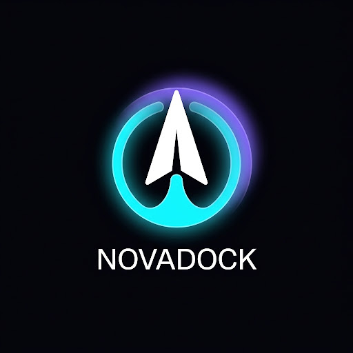
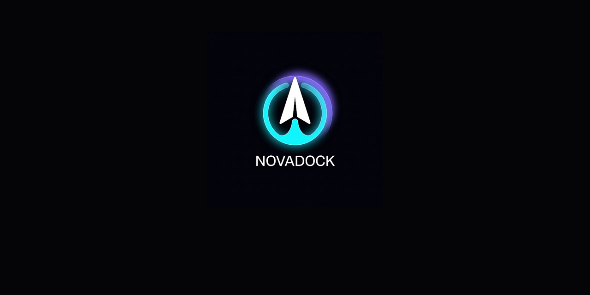
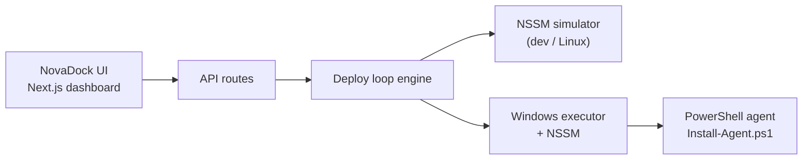

<div align="center">



# NovaDock

**Snap POCs to Windows**

One-click POC deployment with loop-engineered NSSM automation and a premium SaaS control plane.

[](https://nextjs.org/)
[](https://react.dev/)
[](https://www.typescriptlang.org/)
[](https://tailwindcss.com/)
[](https://www.prisma.io/)

[Quick start](#quick-start) · [Features](#features) · [Architecture](#architecture) · [Docs](novadock/README.md)

</div>

---

## What is NovaDock?

NovaDock is an internal **“Vercel for Windows POCs”** — a dashboard where you register a POC app, hit **Deploy**, and NovaDock runs a bounded loop on your Windows host:

**install → NSSM register → start → health check → retry (up to 3×)**

On Linux dev VMs, **Simulate mode** (default) exercises the full loop without real NSSM — perfect for demos and CI.



## Features

| | |
|---|---|
| **One-click deploy** | Template wizard for Node, Python, .NET, or custom entrypoints |
| **Loop engineering** | Phased deploy with verification, bounded retries, and halt reasons |
| **NSSM integration** | Real Windows service registration via `NovaDock-{slug}` services |
| **Premium UI** | Dark aurora dashboard designed with [Google Stitch](https://stitch.withgoogle.com/) |
| **Simulate mode** | Safe local development without Windows or NSSM |
| **Audit trail** | Deploy runs, phase logs, and status history in SQLite |

## Quick start

```bash
git clone https://github.com/shivamongit/new.git
cd new/novadock
pnpm install
pnpm db:push
pnpm db:seed   # optional demo app
pnpm dev
```

Open **http://localhost:3000**

### Run the E2E deploy test

```bash
node scripts/test-deployments.mjs http://localhost:3000
```

## Architecture



```
novadock/
├── src/app/              # Dashboard, deploy wizard, settings, API
├── src/lib/deploy-loop/  # Loop engineering core
├── src/lib/nssm/         # Simulator + Windows executor
├── src/components/stitch/  # Stitch-ported UI shell
├── agent/windows/        # Production Windows setup
├── stitch-designs/       # Stitch reference HTML
└── prisma/               # SQLite persistence
```

## Windows production

1. Run `novadock/agent/windows/Install-Agent.ps1` on your server
2. Place `nssm.exe` in `C:\NovaDock\bin\`
3. In **Settings**, turn off **Simulate mode** and set the NSSM path
4. Deploy POCs from the UI — services register and start automatically

See [novadock/README.md](novadock/README.md) for full documentation.

## Design

UI and logo were generated with **Google Stitch** (project `1486094693945406754`), then implemented in React + Tailwind. Reference screens live in `novadock/stitch-designs/`.

## Repository name

To match the product, rename this repo to **`novadock`** in GitHub **Settings → General → Repository name**, or run:

```bash
gh repo rename novadock
```

---

<div align="center">

**NovaDock** — deploy fast, verify always, halt with clarity.

</div>
