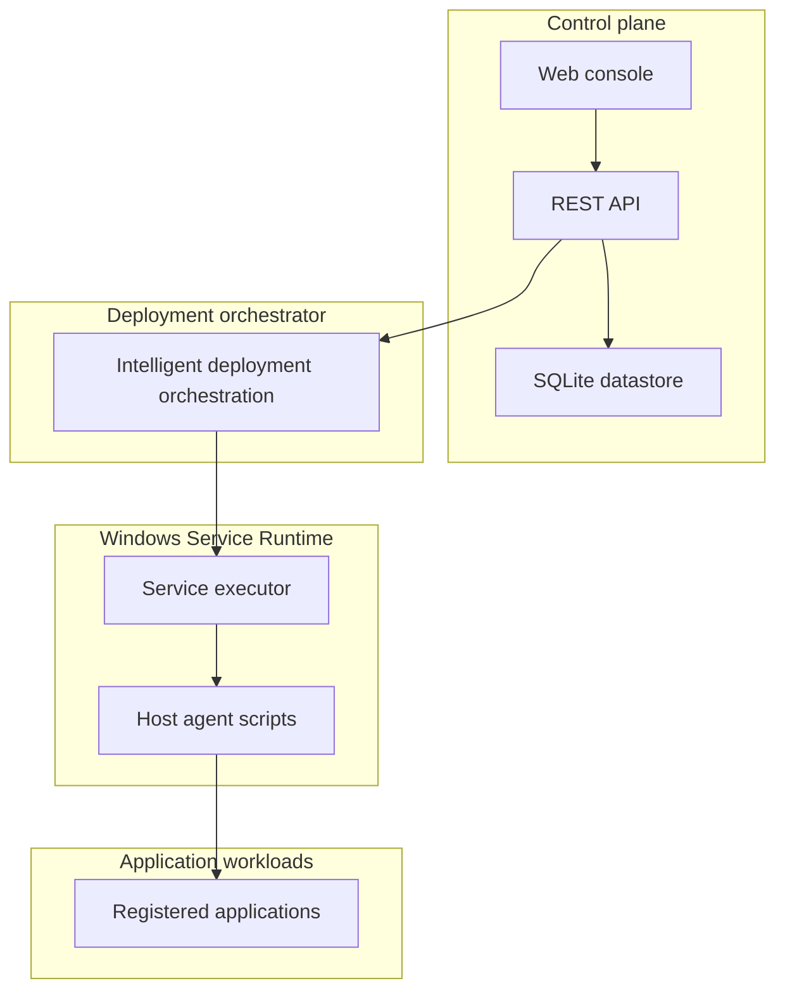

# Architecture

NovaDock is organized as a **control plane** (web UI + API) and a **Windows Service Runtime** that manages long-running application processes on Windows hosts.

## High-level overview



## Control plane

The control plane is a Next.js application (`novadock/`) that provides:

- **Web console** — dashboard, deployment wizard, application detail, and settings.
- **REST API** — programmatic access for CI/CD and internal tooling.
- **Persistence** — applications, deploy runs, and platform settings stored in SQLite via Prisma.

## Deployment orchestrator

The deployment orchestrator runs a **bounded, verifiable pipeline** for each deployment:

1. Prepare dependencies
2. Register the Windows service
3. Start the service
4. Verify health via HTTP
5. Retry on failure (up to three attempts) or halt with an auditable reason

This pipeline is implemented in `src/lib/deploy-loop/` and invoked through the API and UI.

## Windows Service Runtime

On production Windows hosts, NovaDock registers applications as Windows services using **NSSM** (Non-Sucking Service Manager). Each service follows the naming pattern `NovaDock-{slug}`.

The PowerShell agent in `agent/windows/` prepares host directories and can install the runtime binary. Technical details about NSSM appear in [Runtime](runtime.md).

## Development and simulation

**Simulation mode** (default on non-Windows environments) exercises the full orchestration pipeline without touching real Windows services. This enables local development, demos, and automated tests on Linux CI runners.

## API-first design

Every user action in the console maps to an API route. See [API](api.md) for endpoint documentation.

## Extensibility (current)

| Area | Status |
|------|--------|
| REST API for apps, deploy, settings | Implemented |
| Template-based deploy wizard | Implemented |
| Custom executables and health URLs | Implemented |
| Host agent PowerShell scripts | Implemented |
| Authentication / RBAC | Planned |
| Multi-host fleet management | Planned |
| Official CLI | Planned |
| PostgreSQL / external datastore | Planned |

## Repository layout

```
novadock/
├── src/app/              # UI routes and API handlers
├── src/lib/
│   ├── deploy-loop/      # Deployment orchestrator
│   └── nssm/             # Runtime executor + simulator
├── agent/windows/        # Host installation scripts
├── prisma/               # Schema and migrations
└── docs/                 # Product documentation (repo root)
```
